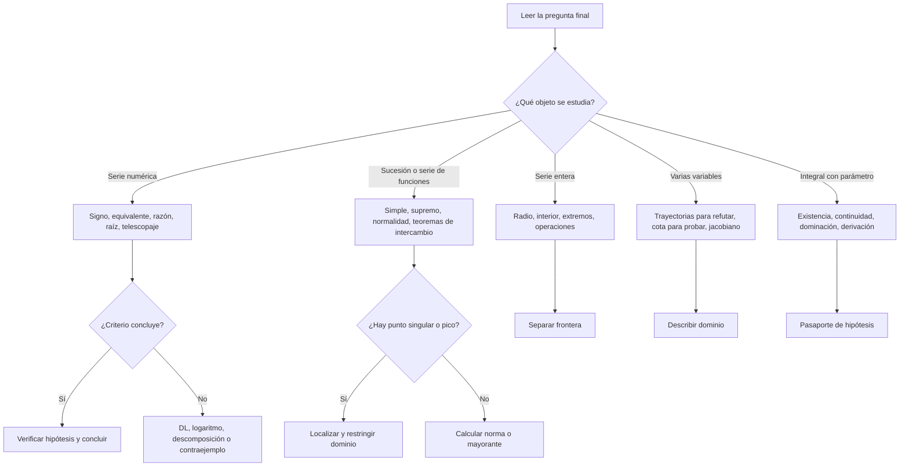
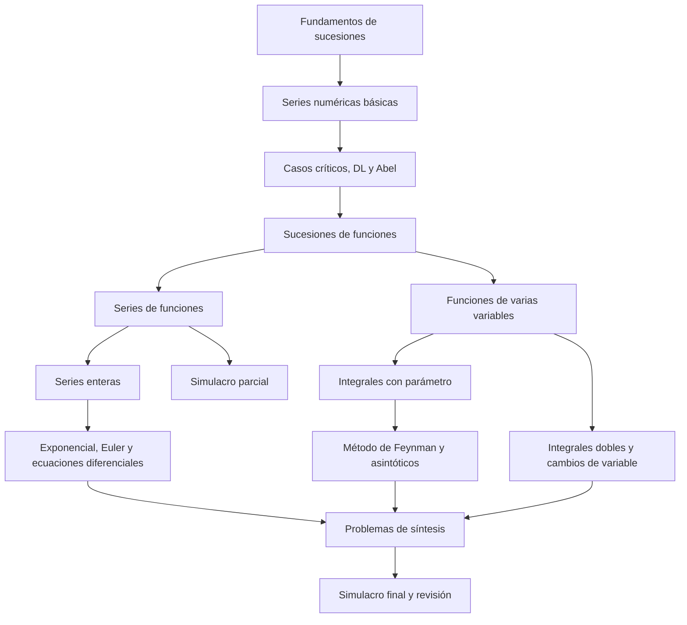
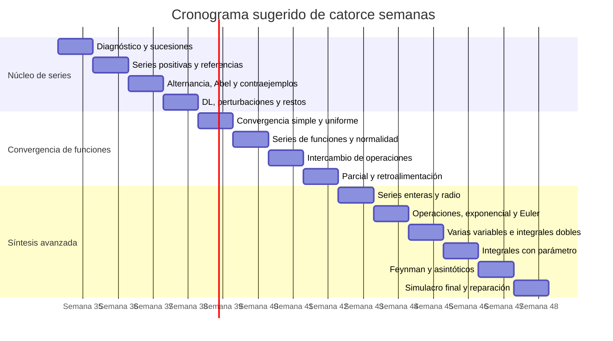

# Rediseño integral del curso de Análisis y Convergencia a partir del polycopié y de los exámenes

## Resumen ejecutivo

El material analizado corresponde a un curso universitario de análisis centrado en series numéricas, sucesiones y series de funciones, series enteras, integrales con parámetro, funciones de varias variables e integrales dobles. La página institucional de la formación lo sitúa en segundo año de Física, con cinco créditos ECTS, veinticuatro horas de curso magistral y veinticuatro horas de trabajos dirigidos; la descripción oficial destaca especialmente los criterios de convergencia, las convergencias simple, uniforme y normal, las propiedades de las sumas de series de funciones, las series enteras y las integrales con parámetro. citeturn12search0

El polycopié tiene una base matemática sólida: enuncia definiciones, demuestra teoremas, proporciona ejemplos y construye una progresión que va de las series numéricas a los intercambios entre límites, derivadas e integrales. Sin embargo, su función principal parece ser **registrar el contenido matemático del curso**, no guiar de forma autónoma el aprendizaje. Le faltan objetivos observables, diagnósticos de prerrequisitos, mapas de decisión para escoger teoremas, ejercicios graduados, análisis sistemático de errores, rúbricas y conexiones explícitas entre cada capítulo y las exigencias de los exámenes. Además, después de los cinco capítulos anunciados en el índice aparecen ampliaciones sobre series, exponencial compleja, el problema de Basilea, productos infinitos y el método de Feynman, sin una reorganización equivalente del índice ni una explicación clara de qué parte es esencial y qué parte es profundización. fileciteturn0file2

Los exámenes revelan que no basta con recordar criterios. El estudiante debe ser capaz de:

1. identificar rápidamente la estructura escondida de un problema;
2. escoger el criterio adecuado y explicar por qué sus hipótesis se cumplen;
3. detectar cuándo un criterio no permite concluir;
4. construir contraejemplos;
5. transformar una expresión hasta hacer aparecer una serie o función de referencia;
6. distinguir convergencia simple, uniforme y normal;
7. calcular normas uniformes mediante máximos o supremos;
8. localizar singularidades y trabajar uniformemente lejos de ellas;
9. justificar rigurosamente el intercambio de límite, derivación, suma e integración;
10. combinar varios capítulos en una misma demostración.

Este patrón aparece ya en el parcial de 2020 y en su corrección: uso de equivalentes y del criterio de D’Alembert, distinción entre convergencia absoluta y condicional, descomposición de una expresión no lineal, cálculo de una norma uniforme y comparación entre convergencias simple, uniforme y normal. fileciteturn0file0 fileciteturn0file1 El parcial de 2022 añade preguntas de verdadero o falso con prueba o contraejemplo, estimaciones cuantitativas de restos, casos frontera de criterios y derivación término a término. fileciteturn0file3 Los exámenes de 2023 incluidos en el polycopié exigen además desarrollos asintóticos, “jorobas móviles”, comportamiento en puntos frontera, construcción de funciones auxiliares constantes, diferenciación bajo el signo integral e integración por partes para obtener equivalentes. fileciteturn0file2

La reconstrucción propuesta convierte cada capítulo en una secuencia recurrente:

Esta estructura aplica alineación entre objetivos, actividades y evaluación: los objetivos deben expresar lo que el estudiante será capaz de hacer, las actividades deben entrenar exactamente esas actuaciones y la evaluación debe comprobarlas. citeturn13search2turn13search11 También incorpora evaluación formativa frecuente, entendida como evaluación que utiliza retroalimentación para ajustar la enseñanza y el aprendizaje durante el proceso, no solo al final. citeturn9search0turn9search3

El rediseño no elimina las demostraciones ni reduce la exigencia. Al contrario: conserva el rigor, pero hace visibles las decisiones que un experto toma y que el texto original suele dejar implícitas. La principal mejora consiste en enseñar no solo **qué teoremas existen**, sino **cómo reconocer cuándo emplearlos, cómo redactar su aplicación y cómo reaccionar cuando no funcionan**.

## Diagnóstico del material y de la evaluación

### Manera de enseñar y presentar las matemáticas

El polycopié emplea una estructura clásica:

> definición → propiedad o teorema → demostración → ejemplo.

Esta estructura es adecuada para conservar rigor y construir una teoría coherente. El tratamiento de las series numéricas, por ejemplo, comienza con las sucesiones, define la convergencia mediante sumas parciales, estudia ejemplos canónicos y después introduce comparación, equivalentes, criterios de Cauchy y D’Alembert, comparación con integrales, convergencia absoluta, series alternadas y Abel. La misma lógica se repite para las sucesiones y series de funciones: definiciones de convergencia simple y uniforme, norma del supremo, criterio de Cauchy uniforme y resultados de conservación de continuidad, derivabilidad e integrabilidad. fileciteturn0file2

Sus principales fortalezas son las siguientes:

| Fortaleza | Manifestación en el material | Utilidad |
|---|---|---|
| Rigor formal | Las propiedades importantes suelen acompañarse de demostración | Permite aprender a justificar y no solo a calcular |
| Buenos ejemplos canónicos | Serie armónica, geométrica, \(x^n\), \(nxe^{-nx}\), \(\sqrt{x^2+1/n}\) | Proporciona modelos reutilizables |
| Progresión conceptual | Series numéricas antes de series de funciones y series enteras | Reduce dependencias lógicas |
| Atención a hipótesis | Los teoremas de derivación e integración precisan condiciones | Coincide con las exigencias de los exámenes |
| Presencia de contraejemplos | Convergencia simple sin uniformidad, derivadas que no convergen uniformemente | Desarrolla vigilancia lógica |
| Demostraciones constructivas | Muchas pruebas muestran de dónde viene la estimación | Favorece transferencia a ejercicios nuevos |

Las debilidades no son principalmente matemáticas, sino didácticas y arquitectónicas:

| Brecha | Consecuencia para el estudiante |
|---|---|
| Objetivos de aprendizaje ausentes o implícitos | El alumno no sabe qué actuaciones concretas debe dominar |
| Escasa señalización de importancia | Una definición, una técnica de examen y una ampliación avanzada pueden parecer igualmente prioritarias |
| Poca explicación de la elección del método | Se ve el criterio correcto después de que el autor ya lo eligió, pero no cómo reconocerlo |
| Pocos ejercicios intermedios dentro de la exposición | El salto entre comprender un ejemplo y resolver un examen es demasiado grande |
| Ausencia de análisis de errores | No se enseñan explícitamente las confusiones más frecuentes |
| Escasa recuperación acumulativa | Los capítulos anteriores no se reactivan de manera programada |
| Falta de rúbricas de redacción | “Justificar precisamente” aparece en los exámenes, pero no se descompone en criterios observables |
| Desajuste del índice | Las ampliaciones posteriores no quedan integradas en el mapa inicial del curso |
| Notación y maquetación densas | Aumentan la carga de lectura, especialmente para quien todavía no distingue lo esencial de lo accesorio |
| Frontera entre curso obligatorio y profundización no especificada | El alumno puede dedicar demasiado tiempo a contenidos sofisticados o ignorar contenido evaluable |

Un curso escrito eficaz necesita facilitar una estructura interna visible. Los objetivos, las evaluaciones y las actividades deben reforzarse entre sí; cuando no están alineados, el alumno puede estudiar contenido correcto pero no practicar el tipo de desempeño requerido en el examen. citeturn13search2turn13search11 Los materiales también deberían segmentarse, señalar la información esencial, presentar previamente la terminología necesaria y eliminar elementos que compitan innecesariamente por la atención. Estos principios de coherencia, señalización, segmentación y preentrenamiento forman parte de la investigación sobre aprendizaje multimedia y son igualmente aplicables a un texto matemático con fórmulas, diagramas y comentarios. citeturn13search4

### Lo que esperan realmente los exámenes

La frase recurrente de los exámenes es que las respuestas deben estar “precisamente justificadas”. Esto significa que la calificación no depende solo de obtener “converge” o “diverge”, sino de producir una cadena lógica verificable. Los exámenes duran dos horas, prohíben documentos y calculadoras y combinan preguntas breves con problemas largos. fileciteturn0file2 fileciteturn0file3

La comparación muestra una estabilidad considerable en las competencias evaluadas:

| Fuente | Temas dominantes | Formato | Razonamiento exigido |
|---|---|---|---|
| Parcial 2020 | Series numéricas; sucesiones y series de funciones | Cuatro problemas estructurados | Equivalentes, D’Alembert, alternancia, descomposición, norma uniforme |
| Corrección 2020 | Métodos esperados | Soluciones breves y directas | Identificar la referencia mínima suficiente y concluir por un teorema |
| Parcial 2022 | Verdadero/falso; series; funciones; series de funciones | Prueba o contraejemplo y problemas | Casos frontera, estimación de restos, localización de uniformidad, derivación término a término |
| Parcial 2023 | Series, jorobas móviles, singularidad en \(0\) | Problemas con indicaciones parciales | Desarrollo limitado, supremum, intercambio integral-límite, comportamiento de derivadas |
| Final 2023 | Series enteras, varias variables, Euler/Basilea, integral con parámetro | Preguntas de curso y síntesis | Combinar teoremas, construir función auxiliar, derivar bajo integral, encuadrar y obtener asintóticos |

fileciteturn0file0 fileciteturn0file1 fileciteturn0file2 fileciteturn0file3

El razonamiento esperado puede resumirse en ocho operaciones cognitivas.

| Operación | Señal típica del enunciado | Acción esperada |
|---|---|---|
| Clasificar | “Estudiar la convergencia” | Reconocer signo, oscilación, factoriales, potencias, logaritmos o equivalentes |
| Reducir | Expresión complicada | Transformarla en una serie o función de referencia |
| Verificar | “Aplicar el teorema del curso” | Enunciar y comprobar todas las hipótesis |
| Refutar | “Verdadero o falso” | Construir un contraejemplo que satisfaga exactamente la hipótesis |
| Cuantificar | “Calcular la norma”, “acotar el resto” | Encontrar un supremo, máximo o cota explícita |
| Localizar | “Uniformemente en…” | Identificar el punto o la zona problemática |
| Sintetizar | Función auxiliar o integral con parámetro | Combinar resultados de varios capítulos |
| Redactar | “Justificar precisamente” | Separar hipótesis, cálculo y conclusión |

### Patrones recurrentes de razonamiento

El primer patrón es la **reducción asintótica**. En la corrección de 2020,  
\[
\frac{\ln(1+1/n)}{\sqrt n}\sim \frac1{n^{3/2}}
\]
reduce el problema a una serie de Riemann, mientras que la razón de términos sucesivos de \(n!/n^n\) conduce directamente a \(1/e<1\). fileciteturn0file1 En 2022 y 2023 aparecen casos en los que la razón o la raíz están en el límite crítico, obligando a desarrollar más finamente la expresión. fileciteturn0file2 fileciteturn0file3

El segundo patrón es la **descomposición de una perturbación**. Para
\[
\frac{u_n}{1+u_n},
\]
la corrección de 2020 introduce
\[
v_n=u_n-\frac{u_n}{1+u_n}
      =\frac{u_n^2}{1+u_n}.
\]
Así,
\[
\frac{u_n}{1+u_n}=u_n-v_n,
\]
donde \(\sum u_n\) converge, pero \(v_n\sim 1/n\), por lo que la nueva serie diverge. La dificultad no es algebraica; consiste en detectar que una perturbación aparentemente pequeña puede acumular un término cuadrático no sumable. fileciteturn0file0 fileciteturn0file1

El tercer patrón es la **distinción entre comportamiento punto por punto y comportamiento global**. En
\[
f_n(x)=\sqrt{x^2+\frac1n},
\]
para cada \(x\) fijo se obtiene \(|x|\), pero la uniformidad exige estudiar
\[
\sup_{x\in\mathbb R}\left|\sqrt{x^2+\frac1n}-|x|\right|.
\]
La corrección localiza el máximo en \(x=0\), donde vale \(1/\sqrt n\). En cambio, las derivadas convergen hacia una función discontinua y no pueden converger uniformemente en todo \(\mathbb R\). fileciteturn0file1

El cuarto patrón es el de las **jorobas móviles**. Una función puede converger a cero para cada \(x\) porque su soporte se desplaza, aunque su altura no disminuya; o puede tener altura decreciente pero área creciente. El parcial de 2023 obliga a dibujar una función triangular, calcular su máximo y comparar la integral del límite con el límite de las integrales. fileciteturn0file2

El quinto patrón es el **pasaporte de hipótesis**. Para derivar una serie de funciones o una integral con parámetro no basta con derivar formalmente. Hay que indicar dominio, regularidad, convergencia simple y convergencia uniforme o normal de las derivadas; en el caso de integrales generalizadas, también una función dominante integrable. El final de 2023 exige incluso formular con precisión el teorema utilizado antes de aplicarlo. fileciteturn0file2

El sexto patrón es la **función auxiliar con derivada nula**. En el problema de Euler se define una combinación de \(S(x)\), \(S(1-x)\) y logaritmos, se demuestra que su derivada es cero y se evalúa en un punto conveniente. Esta estrategia no es una aplicación mecánica de un solo teorema: exige diseñar una expresión cuyas derivadas se cancelen. fileciteturn0file2

### Brechas entre el curso y los exámenes

| Competencia evaluada | Tratamiento en el polycopié | Brecha |
|---|---|---|
| Elegir entre comparación, equivalente, raíz y razón | Los criterios se presentan sucesivamente | Falta un árbol de decisión |
| Encontrar un contraejemplo | Hay algunos contraejemplos en la teoría | Falta un banco organizado por hipótesis fallida |
| Usar desarrollos limitados en series | Aparece en ampliaciones posteriores | Falta integración temprana con los criterios básicos |
| Calcular un supremo | Se ofrecen ejemplos | Falta una rutina general de optimización y localización |
| Distinguir simple, uniforme y normal | Bien definido | Falta una tabla operativa de implicaciones y no implicaciones |
| Aplicar teoremas de intercambio | Teoremas y pruebas presentes | Falta una plantilla de verificación de hipótesis |
| Resolver problemas de frontera | Aparece en ejemplos y exámenes | Falta un protocolo sistemático para extremos y singularidades |
| Construir funciones auxiliares | Aparece en problemas avanzados | Falta enseñar explícitamente el proceso de diseño |
| Redactar una prueba breve | Implícito en las demostraciones | Falta una rúbrica de escritura de examen |
| Integrales dobles y cambios de variable | Capítulo completo | Poca evidencia directa en los exámenes suministrados |
| Corrección oficial del final de 2023 | No incluida | **No especificado** |
| Distribución semanal oficial del contenido | No incluida | **No especificado** |
| Porcentaje exacto de teoría, ejercicios y ampliaciones | No incluido | **No especificado** |
| Rúbrica oficial de puntuación por calidad de la justificación | Solo baremo indicativo por ejercicio | **No especificado** |

## Principios del curso reconstruido

### Arquitectura pedagógica

El curso debe comenzar por los desempeños finales. En lugar de “conocer las series numéricas”, un objetivo útil sería:

> Al finalizar el bloque, el estudiante podrá determinar la naturaleza de una serie nueva, seleccionar un criterio adecuado, comprobar sus hipótesis y redactar una conclusión rigurosa; cuando los criterios elementales sean inconclusos, podrá desarrollar o descomponer el término general.

Los objetivos deben ser centrados en el estudiante, observables y medibles. citeturn13search13 Cada capítulo debería incluir cuatro niveles de objetivo:

| Nivel | Ejemplo |
|---|---|
| Reconocer | Identificar una serie positiva, alternada, telescópica o perturbada |
| Ejecutar | Aplicar correctamente un criterio |
| Justificar | Explicar por qué se cumplen sus hipótesis |
| Transferir | Resolver una variante no idéntica a los ejemplos estudiados |

El rediseño utiliza una progresión de actividad cognitiva: leer una solución es una actividad relativamente pasiva; completar pasos exige actividad; explicar por qué funciona una solución es constructivo; comparar estrategias o corregir una prueba ajena es interactivo. El marco ICAP plantea precisamente que la implicación constructiva e interactiva suele favorecer más aprendizaje que la mera manipulación o recepción pasiva. citeturn11search0turn11search11

La incorporación de actividades no debe convertirse en entretenimiento periférico. El metaanálisis de Freeman y colaboradores, basado en 225 estudios universitarios STEM, encontró mejores resultados medios y menores tasas de fracaso con aprendizaje activo que con exposición exclusivamente magistral; sin embargo, “actividad” debe significar resolver, argumentar, predecir o explicar, no solo hacer clic o copiar fórmulas. citeturn10search0

### Plantilla de cada unidad escrita

Cada unidad debería emplear la siguiente plantilla:

1. **Pregunta de entrada.** Un problema corto que exponga la necesidad del concepto.
2. **Prerrequisitos.** Tres o cuatro elementos que el estudiante debe recuperar.
3. **Objetivos observables.** Acciones que aparecerán también en la evaluación.
4. **Intuición inicial.** Una explicación gráfica, geométrica o algebraica.
5. **Definición formal.** Presentada después de aclarar el problema que resuelve.
6. **Mapa de hipótesis.** Tabla “qué exige / qué permite / qué no permite”.
7. **Ejemplo experto comentado.** Incluye las decisiones, no solo los cálculos.
8. **Ejemplo incompleto.** Se retiran progresivamente pasos.
9. **Error típico.** Solución falsa que debe diagnosticarse.
10. **Actividad interactiva.** Comparación, clasificación, explicación o prueba por parejas.
11. **Mini evaluación sin apuntes.** Recuperación de memoria y transferencia.
12. **Retroalimentación.** Indica qué está bien, qué falta y qué acción concreta corrige la deficiencia.
13. **Síntesis de una página.** Definiciones, señales, teoremas y contraejemplos.
14. **Problemas de examen.** Uno rutinario, uno de decisión y uno de síntesis.

La práctica de recuperación debe ser periódica y acumulativa. En los experimentos clásicos de Roediger y Karpicke, intentar recuperar la información mediante pruebas produjo mejor retención demorada que volver a estudiar repetidamente, aun cuando la relectura generaba más confianza inmediata. citeturn10search1turn10search2

Los ejemplos resueltos son especialmente útiles al comienzo, pero deben incluir preguntas de autoexplicación: “¿por qué este criterio?”, “¿qué hipótesis sería falsa si cambiamos el dominio?”, “¿dónde está el punto difícil?”. La investigación sobre ejemplos resueltos muestra beneficios para el aprendizaje matemático, aunque también advierte que demasiadas preguntas añadidas pueden aumentar la carga en problemas complejos; por ello, la guía debe retirar el apoyo de forma gradual. citeturn11search3turn11search4

### Rúbrica general de una respuesta de examen

| Criterio | Excelente | Suficiente | Insuficiente |
|---|---|---|---|
| Identificación de la estructura | Reconoce la familia y anticipa el obstáculo | Reconoce parcialmente el método | Aplica un criterio sin relación |
| Teorema e hipótesis | Enuncia o identifica el teorema y verifica todas las condiciones | Usa el teorema correcto con alguna condición implícita | Cita un teorema cuyas hipótesis no se cumplen |
| Desarrollo matemático | Cálculos correctos, ordenados y suficientes | Cálculo esencial correcto con omisiones menores | Error que invalida la conclusión |
| Conclusión lógica | Responde exactamente a la pregunta y distingue casos | Conclusión correcta pero poco precisa | Conclusión no deducida |
| Comunicación | Notación clara, frases completas, equivalentes y dominios precisos | Comprensible con pequeñas ambigüedades | Cadena de fórmulas sin explicación |

Una distribución orientativa sería 20 % para identificación, 25 % para hipótesis, 30 % para desarrollo, 15 % para conclusión y 10 % para comunicación. Esta distribución es una propuesta didáctica; la rúbrica oficial del curso es **no especificada**.

Las rúbricas deben conocerse antes de la actividad, porque pueden orientar la autoevaluación, la coevaluación y la revisión. Los recursos del INTEF recomiendan combinar diagnóstico inicial, tareas con guías de evaluación, diarios de aprendizaje y rúbricas conocidas de antemano. citeturn9search1turn9search2turn9search18

### Retroalimentación

La retroalimentación no debe limitarse a “bien” o “mal”. Debe responder a tres preguntas:

| Pregunta | Ejemplo |
|---|---|
| ¿Hacia dónde voy? | “Debes demostrar uniformidad, no solo convergencia para cada \(x\)” |
| ¿Dónde estoy? | “Tu argumento fija \(x\), por lo que solo demuestra convergencia simple” |
| ¿Cuál es el siguiente paso? | “Calcula \(\sup_x|f_n(x)-f(x)|\) o construye \(x_n\) que mantenga el error alejado de cero” |

La retroalimentación puede tener efectos positivos o negativos según su contenido y forma; es más útil cuando informa sobre la tarea, el proceso y los pasos de mejora que cuando se limita a elogiar o juzgar a la persona. citeturn13search0

### Accesibilidad y flexibilidad

El curso debería ofrecer varias representaciones del mismo concepto: formal, gráfica, verbal y mediante ejemplos. El Diseño Universal para el Aprendizaje propone flexibilizar objetivos, contenidos, métodos, materiales y evaluación para que más estudiantes puedan acceder al aprendizaje sin reducir la exigencia cognitiva. citeturn9search5

En este curso, eso implica:

- fórmulas acompañadas de interpretación verbal;
- diagramas de implicaciones;
- gráficos para convergencia uniforme;
- tablas de hipótesis;
- soluciones completas y soluciones anotadas;
- versiones imprimibles de las síntesis;
- actividades individuales antes de la discusión en parejas;
- glosario francés-español si el estudiante trabaja con el original en francés.

## Guía reconstruida por temas

### Series numéricas

#### Análisis del material y razonamiento esperado

El capítulo original cubre correctamente definición mediante sumas parciales, series geométricas, armónica y telescópicas, comparación, equivalentes, raíz, razón, comparación serie-integral, convergencia absoluta, series alternadas y Abel. Las ampliaciones posteriores añaden agrupamiento, desarrollos limitados, estimación del resto alternado y comparación más refinada entre series e integrales. fileciteturn0file2

Los exámenes no preguntan normalmente “enuncie el criterio de D’Alembert”. Presentan una expresión y esperan que el estudiante descubra qué transformación la vuelve reconocible. Los razonamientos dominantes son:

\[
\text{expresión nueva}
\longrightarrow
\text{forma asintótica o razón}
\longrightarrow
\text{serie de referencia}
\longrightarrow
\text{conclusión}.
\]

También se exige distinguir cuidadosamente:

\[
u_n\to0
\quad\not\Rightarrow\quad
\sum u_n\text{ converge},
\]
\[
\sum |u_n|\text{ converge}
\quad\Rightarrow\quad
\sum u_n\text{ converge},
\]
pero no recíprocamente.

Las preguntas de verdadero o falso de 2022 y 2023 muestran que el alumno debe poseer una biblioteca pequeña de contraejemplos: armónica, alternada armónica, series de Riemann, series geométricas y secuencias con bloques. fileciteturn0file2 fileciteturn0file3

#### Balance didáctico

| Propuesta | Ventaja | Riesgo | Decisión |
|---|---|---|---|
| Árbol de decisión de criterios | Reduce ensayo y error | Puede convertirse en receta rígida | Incluirlo junto con problemas donde ninguna rama concluye |
| Banco de equivalentes | Acelera reconocimiento | Favorece memorización superficial | Exigir justificar composición y signo |
| Contraejemplos mínimos | Mejora verdadero/falso | El alumno puede reutilizarlos sin analizar hipótesis | Pedir adaptar el contraejemplo a cada enunciado |
| Desarrollos limitados tempranos | Prepara casos frontera | Puede aumentar la carga inicial | Introducir solo \(1/(1+x)\), \(\ln(1+x)\), \(e^x\) y \(\sin x\) antes de generalizar |
| Estimación de restos | Añade dimensión cuantitativa | Puede desviar del objetivo de naturaleza | Reservar una sesión específica después de dominar convergencia |

#### Guía paso a paso

**Paso de reconocimiento.** Antes de calcular, el estudiante completa una ficha:

| Pregunta | Opciones |
|---|---|
| ¿Los términos son finalmente positivos? | Sí / no |
| ¿Hay alternancia explícita? | Sí / no |
| ¿Aparecen factoriales o productos? | Probar razón |
| ¿Aparece algo elevado a \(n\)? | Probar raíz |
| ¿Hay logaritmos o trigonometría cerca de cero? | Buscar equivalente |
| ¿La razón o raíz tiende a \(1\)? | El criterio es inconcluso; refinar |
| ¿Hay diferencia \(a_n-a_{n+1}\)? | Buscar telescopaje |
| ¿Es una perturbación de una alternada conocida? | Separar término principal y resto |

**Paso de referencia.** Cada solución debe nombrar explícitamente la escala utilizada:
\[
\sum \frac1{n^\alpha},\qquad
\sum r^n,\qquad
\sum \frac1{n(\ln n)^\alpha}.
\]

**Paso de hipótesis.** Para un equivalente, verificar positividad eventual cuando se usa para comparar naturalezas. Para una serie alternada, comprobar disminución y límite cero. Para D’Alembert o Cauchy, explicar qué ocurre si el límite es menor, mayor o igual que uno.

**Paso de redacción.** Plantilla:

> Para \(n\) suficientemente grande, \(u_n\ge0\). Además, \(u_n\sim v_n\). Como \(\sum v_n\) es una serie de referencia [convergente/divergente], el criterio de equivalencia implica que \(\sum u_n\) [converge/diverge].

**Paso de caso crítico.** Cuando la razón o raíz da uno:

1. no concluir;
2. calcular un equivalente;
3. tomar logaritmos si hay potencias;
4. efectuar un desarrollo limitado;
5. separar un término principal.

**Paso de perturbación no lineal.** Para \(\phi(u_n)\), desarrollar:
\[
\phi(u_n)=a\,u_n+b\,u_n^2+o(u_n^2).
\]
Después estudiar por separado las series asociadas. Este paso es esencial cuando \(\sum u_n\) converge condicionalmente, pero \(\sum u_n^2\) diverge.

#### Actividades interactivas

La actividad principal será un “triaje de criterios”: grupos de estudiantes reciben doce términos generales y deben colocarlos bajo “comparación”, “equivalente”, “raíz”, “razón”, “alternada”, “telescópica” o “ninguno concluye”. Cada elección debe incluir una justificación de una frase.

La segunda actividad será una “clínica de contraejemplos”. Se presentan afirmaciones falsas como “si \(u_n\to0\), entonces \(\sum u_n\) converge”. Cada pareja debe producir el contraejemplo más simple, explicar por qué cumple la hipótesis y señalar exactamente qué conclusión contradice.

La tercera actividad será una “autopsia de solución”: se entrega una demostración que usa D’Alembert con límite uno y concluye convergencia. El estudiante identifica el primer paso inválido y propone una estrategia alternativa.

#### Criterios de evaluación específicos

El estudiante domina este bloque cuando puede:

- escoger un criterio en menos de dos minutos;
- explicar por qué los demás criterios naturales son menos eficientes;
- resolver un caso crítico mediante desarrollo o descomposición;
- producir un contraejemplo ajustado a una afirmación;
- estimar un resto alternado;
- escribir una conclusión sin confundir \(u_n\to0\) con convergencia de la serie.

### Sucesiones y series de funciones

#### Análisis del material y razonamiento esperado

El polycopié diferencia claramente convergencia simple, uniforme y normal, presenta la norma del supremo, el criterio de Cauchy uniforme y los teoremas de conservación de continuidad, derivabilidad e integración. También desarrolla la convergencia normal de series de funciones y el criterio de Abel uniforme. fileciteturn0file2

Los exámenes muestran que la dificultad no está en recitar las definiciones, sino en cambiar correctamente de cuantificadores:

\[
\forall x\,\forall\varepsilon\,\exists N(x,\varepsilon)
\]
para convergencia simple, frente a
\[
\forall\varepsilon\,\exists N(\varepsilon)\,\forall x
\]
para convergencia uniforme.

En el parcial de 2020, la función \(\sqrt{x^2+1/n}\) converge uniformemente hacia \(|x|\), pero las derivadas no convergen uniformemente en todo \(\mathbb R\). fileciteturn0file0 fileciteturn0file1 En 2022 se pregunta además por la uniformidad de las derivadas fuera de un intervalo alrededor del origen, lo que exige reconocer que la obstrucción está localizada en \(x=0\). fileciteturn0file3 En 2023 aparecen funciones con soporte móvil y una serie de funciones cuya suma es continua en cero, pero cuya derivada se vuelve no acotada al aproximarse al extremo. fileciteturn0file2

#### Balance didáctico

| Propuesta | Ventaja | Riesgo | Decisión |
|---|---|---|---|
| Representar gráficamente las funciones | Hace visible el pico móvil | El gráfico no prueba uniformidad | Exigir después norma o sucesión testigo |
| Enseñar por cuantificadores | Aclara la diferencia lógica | Puede resultar abstracto | Combinar colores, lenguaje verbal y ejemplos |
| Protocolo “simple → supremo → localización” | Estandariza la resolución | No siempre se puede calcular el supremo exactamente | Añadir métodos de cota superior y sucesión testigo |
| Tabla de implicaciones | Evita confusiones | Puede memorizarse sin comprender | Añadir contraejemplo para cada no implicación |
| Pasaporte para derivar e integrar | Mejora rigor | Puede volver pesada la redacción | Usar versión corta de cuatro líneas |

#### Guía paso a paso

**Convergencia simple.**

1. Fijar \(x\).
2. Tratar por separado puntos excepcionales.
3. calcular \(\lim_{n\to\infty}f_n(x)\);
4. definir la función límite \(f\);
5. comprobar que está definida en todo el dominio.

**Convergencia uniforme.**

1. Formar \(E_n(x)=|f_n(x)-f(x)|\).
2. Buscar \(\|f_n-f\|_\infty=\sup_xE_n(x)\).
3. Si el supremo es difícil, encontrar una cota \(E_n(x)\le a_n\to0\).
4. Para demostrar que no es uniforme, buscar \(x_n\) tal que \(E_n(x_n)\not\to0\).
5. Indicar si la uniformidad se recupera en un subconjunto alejado del punto problemático.

**Jorobas móviles.**

Para funciones cuya altura, anchura o posición dependen de \(n\), registrar:

| Magnitud | Pregunta |
|---|---|
| Soporte | ¿Se desplaza o se contrae? |
| Altura | ¿Tiende a cero? |
| Área | ¿Tiende a cero? |
| Máximo | ¿Dónde se alcanza? |
| Punto fijo | ¿Permanece eventualmente fuera del soporte? |

Así se distingue:

- convergencia simple: observa un punto fijo;
- convergencia uniforme: observa la altura máxima;
- convergencia de integrales: observa el área.

**Series de funciones.**

1. Definir las sumas parciales \(S_N\).
2. Para normalidad, calcular o acotar \(\|f_n\|_\infty\).
3. Comparar \(\sum\|f_n\|_\infty\) con una serie numérica.
4. Deducir uniformidad si hay convergencia normal.
5. Aplicar continuidad, derivabilidad o integración solo después de verificar sus hipótesis.

**Derivación término a término.**

Plantilla:

> Cada \(f_n\) es derivable en \(I\). La serie \(\sum f_n\) converge simplemente en \(I\), por ejemplo porque converge en [un punto o todo el intervalo]. La serie \(\sum f_n'\) converge uniformemente —o normalmente— en \(I\). Por el teorema de derivación de series de funciones, la suma \(f\) es derivable y \(f'=\sum f_n'\).

**Fronteras y singularidades.**

Si el teorema funciona en \([a,\infty)\) para todo \(a>0\), no se debe concluir automáticamente que funciona en \([0,\infty)\). Se estudia primero el intervalo interior y después el extremo por separado mediante límite, cociente incremental, desigualdad o teorema del valor medio.

#### Actividades interactivas

Una actividad gráfica usa tres familias:

\[
x^n,\qquad nxe^{-nx},\qquad
\sqrt{x^2+\frac1n}.
\]

Antes de calcular, los estudiantes predicen convergencia simple y uniforme. Después deben probar o refutar sus predicciones mediante la norma uniforme.

Otra actividad presenta cuatro argumentos:

1. “Para cada \(x\), el error tiende a cero, luego la convergencia es uniforme.”
2. “La función límite es discontinua y las \(f_n\) son continuas, luego no hay uniformidad.”
3. “La altura del pico es constante, luego no hay uniformidad.”
4. “El soporte se desplaza al infinito, luego la integral tiende a cero.”

Deben clasificar cuáles son válidos, inválidos o incompletos y explicar por qué.

#### Criterios de evaluación específicos

El estudiante domina el bloque cuando:

- escribe correctamente los cuantificadores;
- calcula un supremo o construye una sucesión testigo;
- identifica la zona que destruye la uniformidad;
- distingue altura, anchura y área de una joroba;
- verifica todas las hipótesis antes de intercambiar operaciones;
- trata separadamente interior y frontera.

### Series enteras, exponencial y problemas de Euler

#### Análisis del material y razonamiento esperado

El polycopié define el radio de convergencia, demuestra convergencia absoluta en el interior y divergencia fuera, presenta las reglas de Cauchy y D’Alembert, estudia la derivación e integración término a término, la relación entre coeficientes y derivadas, el desarrollo en serie entera y la resolución de ecuaciones diferenciales. Las ampliaciones construyen la exponencial real y compleja, el número \(\pi\), productos infinitos y una demostración del problema de Basilea. fileciteturn0file2

El final de 2023 exige tres niveles de dominio:

1. calcular el radio, incluso cuando los exponentes no son todos los enteros;
2. justificar regularidad y derivación dentro del radio;
3. transformar una serie en una función conocida y construir identidades globales.

También exige no confundir el comportamiento interior con el comportamiento en la frontera \(x=\pm R\). fileciteturn0file2

#### Balance didáctico

| Propuesta | Ventaja | Riesgo | Decisión |
|---|---|---|---|
| Separar radio, interior y frontera | Previene errores frecuentes | Añade etapas a problemas sencillos | Convertirlo en protocolo obligatorio |
| Enseñar “series como funciones” | Conecta con derivación e integración | Puede ocultar la naturaleza de serie numérica en cada \(x\) | Alternar las dos perspectivas |
| Reconstruir funciones conocidas | Aumenta sentido conceptual | Puede reducirse a memorizar desarrollos | Derivar desarrollos desde la geométrica |
| Introducir Euler como proyecto | Integra varios capítulos | Es cognitivamente exigente | Usarlo después de dominar casos básicos |
| Usar coeficientes por identificación | Prepara ecuaciones diferenciales | Errores frecuentes de índices | Incluir ejercicios específicos de cambio de índice |

#### Guía paso a paso

**Radio de convergencia.**

1. Identificar los coeficientes \(a_n\).
2. Probar
   \[
   \left|\frac{a_{n+1}}{a_n}\right|
   \quad\text{o}\quad
   |a_n|^{1/n}.
   \]
3. Si faltan muchos exponentes, considerar directamente el término general para un \(x\) fijo.
4. Encontrar \(R\).
5. Escribir:
   \[
   |x|<R:\text{ convergencia absoluta},\qquad
   |x|>R:\text{ divergencia}.
   \]
6. Estudiar \(x=R\) y \(x=-R\) por separado.

**Operaciones dentro del radio.**

Dentro de \((-R,R)\), la suma puede derivarse e integrarse término a término. El estudiante debe indicar que el radio se conserva y que la convergencia es normal en todo segmento compacto interior.

**Biblioteca generadora.**

En lugar de memorizar muchas fórmulas, se parte de:
\[
\frac1{1-x}=\sum_{n=0}^{\infty}x^n,\qquad |x|<1.
\]

De allí se derivan:

\[
\frac1{(1-x)^2}=\sum_{n=1}^{\infty}n x^{n-1},
\]
\[
-\ln(1-x)=\sum_{n=1}^{\infty}\frac{x^n}{n},
\]
y otras identidades mediante derivación, integración, sustitución y combinación lineal.

**Construcción de una función auxiliar.**

Cuando se quiere demostrar una identidad:

1. identificar las series o integrales relacionadas;
2. buscar una combinación cuyas derivadas se simplifiquen;
3. calcular la derivada;
4. demostrar que es cero;
5. evaluar la constante en un punto conveniente;
6. justificar los límites en los extremos.

**Ecuaciones diferenciales por series.**

1. suponer \(y=\sum a_nx^n\);
2. derivar formalmente;
3. sustituir en la ecuación;
4. alinear exponentes;
5. identificar coeficientes;
6. usar condiciones iniciales;
7. calcular el radio;
8. verificar que la solución obtenida es válida en el intervalo anunciado.

#### Actividades interactivas

La actividad central será un “laboratorio de índices”. Cada grupo recibe una igualdad incorrecta entre dos series en la que el cambio de índice está desplazado. Debe corregirla y explicar qué ocurre con el término constante.

Otra actividad consiste en reconstruir cuatro desarrollos a partir de la serie geométrica sin consultar apuntes.

Una actividad de síntesis reproduce la estructura del problema de Euler, pero con una serie más sencilla:
\[
S(x)=\sum_{n=1}^\infty \frac{x^n}{n(n+1)}.
\]
Los estudiantes deben hallar el radio, derivar o descomponer los coeficientes y encontrar una expresión cerrada.

#### Criterios de evaluación específicos

Se valorará que el estudiante:

- distinga radio y comportamiento en los extremos;
- justifique operaciones término a término;
- maneje correctamente cambios de índice;
- derive identidades desde series conocidas;
- construya y evalúe una función auxiliar;
- señale el dominio exacto de validez de cada fórmula.

### Funciones de varias variables e integrales dobles

#### Análisis del material y razonamiento esperado

El polycopié introduce continuidad en \(\mathbb R^2\), continuidad uniforme en compactos, derivadas parciales, diferenciabilidad, composición, integrabilidad de Riemann por sumas de Darboux, conjuntos de área nula, Fubini y cambios de variable con jacobiano. fileciteturn0file2

La evidencia directa de evaluación es menor que para series y convergencia de funciones. En el final de 2023 se piden derivadas parciales y continuidad de una función definida de forma especial en el origen, pero los exámenes suministrados no incluyen un problema completo de Fubini o cambio de variables. Por tanto, el peso exacto de integrales dobles en la evaluación es **no especificado**. fileciteturn0file2

El razonamiento fundamental es distinguir:

\[
\text{existencia de derivadas parciales}
\quad\not\Rightarrow\quad
\text{diferenciabilidad},
\]
y reconocer que la continuidad en un punto singular debe verificarse por todas las trayectorias, no solo por los ejes.

#### Balance didáctico

| Propuesta | Ventaja | Riesgo | Decisión |
|---|---|---|---|
| Empezar con trayectorias | Detecta discontinuidad rápidamente | Probar varias trayectorias iguales no demuestra continuidad | Presentarlas como método de refutación, no de prueba |
| Representar dominios antes de integrar | Reduce errores de límites | Consume tiempo | Convertir el dibujo en requisito breve |
| Enseñar Fubini como descripción geométrica | Une cálculo y dominio | Puede ocultar hipótesis | Añadir siempre la regularidad de \(f\) y del dominio |
| Plantilla para cambios de variable | Evita olvidar el jacobiano | Riesgo de aplicación mecánica | Exigir verificar imagen, dominio y multiplicidad |

#### Guía paso a paso

**Continuidad en un punto especial.**

1. Calcular el valor propuesto en el punto.
2. Simplificar \(f(x,y)-f(0,0)\).
3. Probar trayectorias simples para buscar contradicciones.
4. Si no aparece contradicción, buscar una cota en función de
   \[
   \|(x,y)\|=\max(|x|,|y|)
   \quad\text{o}\quad
   r=\sqrt{x^2+y^2}.
   \]
5. Concluir solo después de obtener una cota que tienda a cero.

**Diferenciabilidad.**

1. Calcular derivadas parciales.
2. Proponer la aplicación lineal candidata:
   \[
   L(h,k)=f_x(a,b)h+f_y(a,b)k.
   \]
3. Estudiar el resto
   \[
   f(a+h,b+k)-f(a,b)-L(h,k).
   \]
4. Dividir por \(\sqrt{h^2+k^2}\) o una norma equivalente.
5. Demostrar que el cociente tiende a cero.

Si las derivadas parciales existen y son continuas en un entorno, puede usarse el teorema suficiente de clase \(C^1\).

**Integral doble.**

1. Dibujar el dominio.
2. Decidir si es más natural describirlo vertical u horizontalmente.
3. Escribir los límites.
4. Aplicar Fubini.
5. Comprobar el resultado mediante signo, dimensión y orden de magnitud.

**Cambio de variables.**

1. Definir la transformación.
2. hallar el dominio en las nuevas variables;
3. calcular el jacobiano;
4. tomar su valor absoluto;
5. transformar el integrando;
6. verificar si la parametrización es uno a uno salvo fronteras;
7. integrar.

#### Actividades interactivas

Los estudiantes reciben varias funciones discontinuas en el origen y deben elegir una trayectoria que revele rápidamente la discontinuidad. Después reciben una función continua que parece dependiente de la trayectoria y deben demostrar continuidad mediante una cota radial.

Para Fubini, cada pareja recibe un dominio dibujado. Un estudiante describe el dominio con rebanadas verticales y el otro con rebanadas horizontales; comparan cuál orden produce una integral más simple.

Para cambios de variable, se usa una elipse. Primero se predice el factor de área geométricamente; después se calcula el jacobiano de \((u,v)\mapsto(au,bv)\).

#### Criterios de evaluación específicos

Se exige:

- no usar únicamente trayectorias para probar continuidad;
- diferenciar derivadas parciales y diferenciabilidad;
- dibujar o describir inequívocamente el dominio;
- incluir el valor absoluto del jacobiano;
- justificar el uso de Fubini o cambio de variables;
- verificar plausibilidad del resultado.

### Integrales con parámetro y método de Feynman

#### Análisis del material y razonamiento esperado

El curso presenta primero integrales sobre un intervalo compacto:
\[
F(x)=\int_a^b f(x,t)\,dt,
\]
y demuestra continuidad y derivabilidad cuando \(f\) y \(\partial_xf\) son continuas. Después estudia integrales generalizadas, donde se necesitan funciones dominantes integrables. Las ampliaciones desarrollan el método de Feynman mediante ejemplos en los que se introduce un parámetro para convertir una integral difícil en una ecuación diferencial o una integral elemental. fileciteturn0file2

El final de 2023 exige demostrar que una integral está bien definida, justificar continuidad, formular el teorema de derivación bajo el integral, deducir monotonía, calcular una aproximación de primer orden, integrar por partes y obtener una estimación asintótica. fileciteturn0file2

El razonamiento esperado tiene una estructura muy estable:

\[
\text{existencia}
\to
\text{regularidad}
\to
\text{derivación bajo integral}
\to
\text{signo o ecuación}
\to
\text{estimación/asintótico}.
\]

#### Balance didáctico

| Propuesta | Ventaja | Riesgo | Decisión |
|---|---|---|---|
| Pasaporte de hipótesis | Reduce aplicaciones formales inválidas | Puede parecer repetitivo | Repetir hasta automatizar y luego abreviar |
| Separar compacto e impropio | Evita usar dominación innecesaria o insuficiente | Añade clasificación inicial | Convertirla en la primera pregunta |
| Introducir parámetros diseñados por el alumno | Desarrolla creatividad | Demasiado abierto al inicio | Empezar con parámetros sugeridos y retirar apoyo |
| Usar desigualdades antes de equivalentes | Da pruebas rigurosas | Puede ser técnicamente largo | Enseñar patrones de encuadre reutilizables |

#### Guía paso a paso

**Clasificación inicial.**

| Situación | Herramienta típica |
|---|---|
| \(t\in[a,b]\), integrando continuo | Continuidad uniforme sobre compactos |
| Dominio no acotado o singular | Dominación integrable |
| Se pide derivar | Dominar \(\partial_x f\), no solo \(f\) |
| Se pide límite en \(x\) | Convergencia uniforme o dominada |
| Se pide monotonía | Estudiar el signo de \(F'\) |
| Se pide asintótico | Integración por partes, cambio de variable o encuadre |

**Existencia.**

1. Identificar singularidades en \(t\).
2. estudiar equivalentes cerca de ellas;
3. verificar integrabilidad absoluta cuando corresponda;
4. declarar el dominio de \(F\).

**Continuidad.**

En intervalo compacto, verificar continuidad de \(f\). En integral generalizada, encontrar \(g(t)\) integrable tal que
\[
|f(x,t)|\le g(t)
\]
uniformemente para \(x\) en el conjunto considerado.

**Derivación bajo el signo integral.**

1. Calcular \(\partial_xf(x,t)\).
2. comprobar su continuidad o existencia;
3. encontrar una dominante integrable independiente de \(x\);
4. enunciar el teorema;
5. escribir
   \[
   F'(x)=\int\partial_xf(x,t)\,dt.
   \]

**Aproximación de primer orden.**

Calcular:
\[
F(0),\qquad F'(0),
\]
y escribir
\[
F(x)=F(0)+xF'(0)+o(x).
\]

**Método de Feynman.**

Para una integral \(I\):

1. introducir un parámetro de manera que \(F(x_0)=I\);
2. escogerlo para que \(\partial_xf\) simplifique el integrando;
3. justificar la derivación;
4. calcular o caracterizar \(F'\);
5. integrar respecto de \(x\);
6. determinar la constante mediante un valor sencillo o un límite.

**Asintóticos.**

1. identificar la zona dominante de integración;
2. efectuar cambio de variable si concentra la masa;
3. integrar por partes para aislar el término principal;
4. acotar el resto;
5. dividir por el candidato equivalente;
6. aplicar encuadre.

#### Actividades interactivas

Una actividad entrega cuatro funciones \(f(x,t)\) y cuatro dominantes candidatas. El alumnado debe emparejarlas y justificar integrabilidad.

Otra actividad presenta una “prueba” que deriva bajo el integral porque el integrando es derivable. Los estudiantes deben señalar que falta uniformidad o dominación de la derivada.

La actividad de diseño pide escoger entre varios parámetros para calcular una integral. No se califica solo el resultado, sino la calidad de la elección: la derivada respecto del parámetro debe simplificar el problema.

#### Criterios de evaluación específicos

El estudiante debe:

- distinguir integral propia e impropia;
- justificar existencia antes de hablar de continuidad;
- escribir una dominante independiente del parámetro;
- formular el teorema adecuado;
- usar el signo de la derivada para estudiar monotonía;
- obtener un primer orden;
- controlar rigurosamente el resto de una aproximación asintótica.

### Estrategias transversales de examen

#### Mapa de decisión global

#### Protocolo de los primeros minutos

Durante la primera lectura:

1. subrayar los verbos: demostrar, calcular, estudiar, deducir;
2. marcar el dominio;
3. detectar puntos especiales: \(0\), \(\pm1\), infinito, extremos del radio;
4. escribir al margen el teorema probable;
5. identificar qué pregunta posterior depende de la actual;
6. empezar por las preguntas que desbloquean varias siguientes.

#### Protocolo de redacción

Una respuesta sólida suele contener cuatro frases:

> **Estructura:** “La serie es de términos positivos a partir de cierto rango.”  
> **Cálculo:** “Se tiene \(u_n\sim n^{-3/2}\).”  
> **Referencia:** “La serie de Riemann de exponente \(3/2>1\) converge.”  
> **Conclusión:** “Por equivalencia, la serie propuesta converge.”

Para un contraejemplo:

> “La afirmación es falsa. Tomemos […]. La hipótesis se cumple porque […]. Sin embargo, la conclusión falla porque […].”

Para un teorema de intercambio:

> “Se verifican las hipótesis siguientes: […]. Por [nombre o formulación del teorema], podemos intercambiar […].”

#### Errores que deben convertirse en objetos de enseñanza

| Error | Diagnóstico | Corrección |
|---|---|---|
| “\(u_n\to0\), luego la serie converge” | Confusión entre condición necesaria y suficiente | Recordar la armónica |
| D’Alembert da \(1\) y se concluye | Criterio inconcluso | Buscar equivalente o DL |
| Se fija \(x\) para probar uniformidad | Solo se demuestra convergencia simple | Calcular supremo |
| Se usa una trayectoria para probar continuidad | Una trayectoria solo puede refutar | Obtener una cota global |
| Se deriva una suma formalmente | Hipótesis omitidas | Usar pasaporte |
| Se aplica un resultado interior en la frontera | Confusión entre compacto interior y extremo | Estudiar extremo aparte |
| Se afirma “la función límite es derivable porque \(f_n\) lo es” | La derivabilidad no pasa por convergencia simple o uniforme de funciones | Controlar derivadas |
| Se encuentra una cota dependiente de \(x\) | No hay uniformidad o dominación uniforme | Buscar cota independiente del parámetro |
| Se construye un contraejemplo que no cumple la hipótesis | Refutación inválida | Verificar hipótesis antes de mostrar el fallo |

## Validación desde el rol del diseñador y del alumno

### Auditoría del curso reconstruido

Desde el rol de una IA diseñadora del curso, la primera versión de la guía todavía tendría cuatro riesgos.

El primero sería **exceso de procedimientos**. Los árboles de decisión ayudan al principiante, pero podrían transmitir que todos los problemas tienen una clasificación inmediata. Para corregirlo, cada bloque debe contener ejercicios donde dos métodos sean posibles y otros donde el primer criterio resulte inconcluso.

El segundo sería **sobrecarga documental**. Si cada ejercicio exige completar una ficha extensa, el estudiante puede concentrarse en el formato y no en la matemática. La solución es retirar gradualmente el apoyo: ficha completa al inicio, lista breve después y automatización en los simulacros.

El tercero sería **insuficiente práctica de diseño**. Los exámenes finales no solo piden aplicar teoremas; piden inventar una función auxiliar, elegir una descomposición o encontrar una dominante. Por eso, las actividades deben incluir decisiones abiertas y comparación entre estrategias.

El cuarto sería **desigual cobertura de los temas**. Las series numéricas y de funciones aparecen repetidamente en los exámenes, mientras que las integrales dobles aparecen poco en la muestra. El curso no debe eliminar estas últimas, pero sí distinguir entre núcleo evaluado, contenido estructural y profundización.

### Examen nuevo de validación

Se propone el siguiente simulacro de dos horas.

#### Problema de verdadero o falso

Decidir, justificando mediante prueba o contraejemplo:

1. Si \(\sum u_n\) converge y \((v_n)\) es acotada, entonces \(\sum u_nv_n\) converge.
2. Si \(a_n>0\) y \(a_{n+1}/a_n\to1\), entonces \(\sum a_n\) diverge.
3. Si \(f_n\to f\) uniformemente y cada \(f_n\) es derivable, entonces \(f\) es derivable.

#### Problema de series numéricas

Estudiar:

\[
\sum_{n\ge1}\frac{e^{1/n}-1}{\sqrt n}
\]
y, para
\[
u_n=\frac{(-1)^n}{\sqrt n},
\]
estudiar
\[
\sum u_n,\qquad
\sum |u_n|,\qquad
\sum\frac{u_n}{1+u_n}.
\]

#### Problema de funciones

Sea
\[
f_n(x)=\sqrt{x^2+\frac1{n^2}}.
\]

1. Determinar la convergencia simple y uniforme en \(\mathbb R\).
2. Estudiar la convergencia de \(f_n'\) en \(\mathbb R\).
3. Estudiar la uniformidad de \(f_n'\) en
   \[
   (-\infty,-a]\cup[a,\infty),\qquad a>0.
   \]
4. Decidir si la función límite es derivable.

#### Problema de síntesis

Sea
\[
S(x)=\sum_{n=1}^\infty\frac{x^n}{n(n+1)}.
\]

1. Calcular el radio de convergencia.
2. Encontrar una expresión cerrada para \(S(x)\) en \((-1,1)\).
3. Estudiar el límite cuando \(x\to0\).

Sea además
\[
F(x)=\int_0^1\frac{e^{xt}}{1+t}\,dt.
\]

4. Probar que \(F\) es de clase \(C^1\) en \(\mathbb R\).
5. Demostrar que es creciente.
6. Obtener su aproximación de primer orden en cero.

### Simulación del intento de un alumno principiante

La simulación no pretende reproducir a una persona concreta, sino someter la guía a una prueba de transferencia.

| Pregunta | Respuesta inicial plausible | Error revelado |
|---|---|---|
| Producto \(u_nv_n\) | “Verdadero porque \(v_n\) está acotada” | Confunde convergencia de serie con dominación absoluta |
| Razón igual a uno | “Diverge porque la razón no es menor que uno” | Ignora que el criterio es inconcluso |
| Límite de derivables | “Es derivable porque la convergencia es uniforme” | Omite control de derivadas |
| Serie transformada \(u_n/(1+u_n)\) | “Converge por alternancia” | No comprueba monotonía y no ve el término cuadrático |
| Uniformidad de \(f_n'\) | “Sí, porque converge para todo \(x\)” | Confunde simple y uniforme |
| Serie entera | Intenta integrar sin determinar primero el dominio | Falta protocolo radio-interior-frontera |
| Integral con parámetro | Escribe directamente \(F'=\int\partial_xf\) | Falta formulación de hipótesis |

### Comparación con las respuestas correctas

El primer enunciado es falso. Puede tomarse
\[
u_n=\frac{(-1)^n}{\sqrt n},
\qquad
v_n=(-1)^n.
\]
La serie \(\sum u_n\) converge por alternancia, \((v_n)\) es acotada, pero
\[
u_nv_n=\frac1{\sqrt n},
\]
cuya serie diverge.

El segundo enunciado es falso porque un límite de razón igual a uno no permite concluir. Tanto \(a_n=1/n\) como \(a_n=1/n^2\) tienen razón tendiendo a uno, pero sus series tienen naturalezas distintas.

El tercero es falso: la convergencia uniforme de funciones derivables no garantiza derivabilidad del límite. La familia
\[
f_n(x)=\sqrt{x^2+\frac1{n^2}}
\]
converge uniformemente hacia \(|x|\), que no es derivable en cero.

El intento simulado muestra que la guía necesita reforzar tres elementos:

1. una tabla explícita de lo que cada teorema **no** permite concluir;
2. una práctica acumulativa de contraejemplos;
3. un control obligatorio de hipótesis antes de escribir cualquier intercambio.

### Reconstrucción final de la guía

Tras la validación, se incorporan las siguientes mejoras:

| Brecha detectada | Mejora añadida |
|---|---|
| Criterios usados como reglas bicondicionales | Columna “caso inconcluso” en cada teorema |
| Contraejemplos recordados pero mal adaptados | Plantilla hipótesis–objeto–fallo |
| Confusión simple/uniforme | Pregunta obligatoria: “¿mi \(N\) depende de \(x\)?” |
| Aplicaciones formales de teoremas | Pasaporte de hipótesis evaluado con puntos propios |
| Falta de transferencia | Problemas con datos superficiales distintos pero estructura idéntica |
| Dificultad para construir auxiliares | Ejercicios de ingeniería inversa: se da la cancelación deseada y se busca la función |
| Sobrecarga de guías | Retirada gradual del andamiaje |
| Estudio concentrado antes del examen | Mini pruebas acumulativas y espaciadas |

La práctica debe alternar recuperación, explicación y corrección. La recuperación fortalece la retención demorada; la autoexplicación obliga a generar conexiones; y la corrección de soluciones hace visible el criterio de calidad. citeturn10search1turn11search0

## Arquitectura, cronograma y evaluación

### Estructura final del curso

### Cronograma sugerido

La distribución semanal oficial no figura en los documentos y es, por tanto, **no especificada**. El siguiente cronograma es una propuesta compatible con cuarenta y ocho horas presenciales.

Una distribución orientativa por semana sería:

| Componente | Tiempo presencial | Trabajo autónomo |
|---|---:|---:|
| Exposición segmentada | 60 min | Relectura selectiva |
| Ejemplos y comparación de métodos | 45 min | Autoexplicación |
| Resolución individual | 30 min | Problemas graduados |
| Discusión o corrección por parejas | 30 min | Revisión de errores |
| Mini prueba | 15 min | Recuperación espaciada |
| Retroalimentación | Integrada | Corrección obligatoria |

### Sistema de evaluación formativa

| Momento | Instrumento | Propósito |
|---|---|---|
| Inicio de bloque | Diagnóstico de cinco preguntas | Detectar prerrequisitos |
| Durante la teoría | Predicción antes del ejemplo | Activar razonamiento |
| Final de sesión | Pregunta de salida | Identificar la brecha inmediata |
| Cada semana | Mini prueba sin apuntes | Recuperación y acumulación |
| Cada dos semanas | Problema comentado | Evaluar redacción |
| Antes del parcial | Simulacro completo | Gestión del tiempo y transferencia |
| Después del parcial | Corrección clasificada por errores | Reparar procesos, no solo respuestas |
| Antes del final | Simulacro de síntesis | Integrar capítulos |

La evaluación formativa debe producir cambios durante el proceso: reorganizar ejercicios, volver a explicar una distinción o añadir práctica cuando la evidencia muestra una brecha. citeturn9search0turn9search1

### Rúbrica específica para simulacros

| Dimensión | Peso sugerido |
|---|---:|
| Selección de método | 20 % |
| Verificación de hipótesis | 25 % |
| Exactitud matemática | 30 % |
| Capacidad de síntesis o contraejemplo | 15 % |
| Redacción y notación | 10 % |

Cada corrección debe terminar con una etiqueta de error:

- **C:** concepto;
- **H:** hipótesis;
- **M:** método;
- **A:** álgebra;
- **L:** lógica;
- **R:** redacción;
- **T:** tiempo.

El alumno debe registrar no solo cuántos puntos perdió, sino qué clase de error produjo la pérdida y qué ejercicio paralelo resolverá para repararla.

## Ejercicios de preparación y soluciones

### Banco de ejercicios

#### Series numéricas

**Ejercicio A.** Estudiar la naturaleza de
\[
\sum_{n\ge1}\frac{\ln(1+1/\sqrt n)}{n}.
\]

**Ejercicio B.** Estudiar
\[
\sum_{n\ge1}\frac{(n!)^2}{(2n)!}.
\]

**Ejercicio C.** Sea
\[
u_n=\frac{(-1)^n}{\sqrt n}.
\]
Estudiar la convergencia absoluta y ordinaria de \(\sum u_n\), y la naturaleza de
\[
\sum\frac{u_n}{1+u_n}.
\]

#### Sucesiones y series de funciones

**Ejercicio D.** Sea
\[
f_n(x)=nxe^{-nx},\qquad x\ge0.
\]
Estudiar la convergencia simple y uniforme en \([0,\infty)\), y después en \([a,\infty)\), con \(a>0\).

**Ejercicio E.** Sea
\[
g_n(x)=\sqrt{x^2+\frac1{n^2}}.
\]
Estudiar la convergencia de \(g_n\) y \(g_n'\) en \(\mathbb R\) y fuera de \([-a,a]\).

**Ejercicio F.** En \([0,\infty)\), estudiar la convergencia normal de
\[
\sum_{n=1}^\infty\frac{e^{-nx}}{n^2},
\]
y la convergencia normal de la serie de derivadas en \([a,\infty)\) y en \([0,\infty)\).

#### Series enteras

**Ejercicio G.** Calcular el radio de convergencia de
\[
\sum_{n=1}^\infty\frac{n!}{n^n}x^n.
\]

**Ejercicio H.** Para
\[
S(x)=\sum_{n=1}^\infty\frac{x^n}{n(n+1)},
\]
calcular el radio y obtener una expresión cerrada en \((-1,1)\).

**Ejercicio I.** Resolver mediante series enteras, alrededor de cero,
\[
(1-x)y'=2y,\qquad y(0)=1,
\]
y reconocer la función obtenida.

#### Varias variables e integrales dobles

**Ejercicio J.** Estudiar la continuidad en el origen de
\[
f(x,y)=
\begin{cases}
\dfrac{x^2y}{x^4+y^2},&(x,y)\ne(0,0),\\[4pt]
0,&(x,y)=(0,0).
\end{cases}
\]

**Ejercicio K.** Calcular
\[
\iint_D(x^2+y^2)\,dx\,dy,
\]
donde
\[
D=\{(x,y):x\ge0,\ y\ge0,\ x^2+y^2\le1\}.
\]

**Ejercicio L.** Calcular el área de
\[
E=\left\{(x,y):\frac{x^2}{a^2}+\frac{y^2}{b^2}\le1\right\},
\qquad a,b>0,
\]
mediante un cambio de variables.

#### Integrales con parámetro

**Ejercicio M.** Sea
\[
F(x)=\int_0^1\frac{e^{xt}}{1+t}\,dt.
\]
Demostrar que \(F\in C^1(\mathbb R)\), que es creciente y hallar su desarrollo de primer orden en cero.

**Ejercicio N.** Sea
\[
G(x)=\int_0^\infty e^{-t}\cos(xt)\,dt.
\]
Justificar la derivación bajo el integral y calcular \(G\).

**Ejercicio O.** Sea
\[
H(x)=\int_0^1\frac{t^x-1}{\ln t}\,dt,\qquad x\ge0.
\]
Demostrar que está bien definida, calcular \(H'(x)\) y hallar \(H(x)\).

### Soluciones del examen de validación

#### Verdadero o falso

**Primera afirmación: falsa.** Tomemos
\[
u_n=\frac{(-1)^n}{\sqrt n},
\qquad v_n=(-1)^n.
\]
La serie \(\sum u_n\) converge por el criterio de Leibniz, porque \(1/\sqrt n\) decrece hacia cero. La sucesión \(v_n\) está acotada. Sin embargo,
\[
u_nv_n=\frac1{\sqrt n},
\]
y
\[
\sum\frac1{\sqrt n}
\]
diverge.

**Segunda afirmación: falsa.** Para
\[
a_n=\frac1n
\quad\text{y}\quad
b_n=\frac1{n^2},
\]
se tiene
\[
\frac{a_{n+1}}{a_n}\to1,
\qquad
\frac{b_{n+1}}{b_n}\to1,
\]
pero \(\sum a_n\) diverge y \(\sum b_n\) converge. El criterio de D’Alembert no concluye cuando el límite es uno.

**Tercera afirmación: falsa.** La familia
\[
f_n(x)=\sqrt{x^2+\frac1{n^2}}
\]
está formada por funciones derivables y converge uniformemente hacia \(|x|\), porque
\[
0\le \sqrt{x^2+\frac1{n^2}}-|x|
=\frac{1/n^2}{\sqrt{x^2+1/n^2}+|x|}
\le\frac1n,
\]
con igualdad en \(x=0\). Sin embargo, \(|x|\) no es derivable en cero.

#### Series numéricas

Como
\[
e^t-1\sim t\qquad(t\to0),
\]
se tiene
\[
\frac{e^{1/n}-1}{\sqrt n}
\sim\frac{1/n}{\sqrt n}
=\frac1{n^{3/2}}.
\]
La serie converge por equivalencia con una serie de Riemann de exponente \(3/2>1\).

Para
\[
u_n=\frac{(-1)^n}{\sqrt n},
\]
la serie de valores absolutos es
\[
\sum\frac1{\sqrt n},
\]
que diverge. La serie \(\sum u_n\) converge por alternancia.

Finalmente,
\[
\frac{u_n}{1+u_n}
=u_n-\frac{u_n^2}{1+u_n}.
\]
La primera serie converge. Para la segunda,
\[
\frac{u_n^2}{1+u_n}
\sim u_n^2
=\frac1n,
\]
y sus términos son positivos a partir de cierto rango. Por tanto, su serie diverge. En consecuencia,
\[
\sum\frac{u_n}{1+u_n}
\]
diverge.

#### Funciones

Para cada \(x\),
\[
f_n(x)\to |x|.
\]
Además,
\[
0\le f_n(x)-|x|\le\frac1n,
\]
y en \(x=0\) el error vale \(1/n\). Por tanto,
\[
\|f_n-|\cdot|\|_{\mathbb R}=\frac1n\to0.
\]
La convergencia es uniforme.

Las derivadas son
\[
f_n'(x)=\frac{x}{\sqrt{x^2+1/n^2}}.
\]
Si \(x>0\), tienden a \(1\); si \(x<0\), tienden a \(-1\); y si \(x=0\), valen cero. El límite es
\[
g(x)=
\begin{cases}
-1,&x<0,\\
0,&x=0,\\
1,&x>0.
\end{cases}
\]
Como cada \(f_n'\) es continua y \(g\) es discontinua, la convergencia no es uniforme en \(\mathbb R\).

Si \(|x|\ge a>0\),
\[
\left|
\frac{x}{\sqrt{x^2+1/n^2}}-\operatorname{sgn}(x)
\right|
=
1-\frac{|x|}{\sqrt{x^2+1/n^2}}.
\]
Esta expresión decrece cuando \(|x|\) crece, por lo que su supremo se alcanza en \(|x|=a\):
\[
\sup_{|x|\ge a}
\left|
f_n'(x)-\operatorname{sgn}(x)
\right|
=
1-\frac{a}{\sqrt{a^2+1/n^2}}
\longrightarrow0.
\]
Hay convergencia uniforme fuera de \([-a,a]\).

La función límite \(|x|\) no es derivable en cero.

#### Serie entera e integral con parámetro

Como
\[
\frac1{n(n+1)}
\]
tiene raíz \(n\)-ésima que tiende a uno, el radio de convergencia es \(R=1\).

Usando
\[
\frac1{n(n+1)}=\frac1n-\frac1{n+1},
\]
obtenemos:
\[
S(x)
=\sum_{n=1}^\infty\frac{x^n}{n}
-\sum_{n=1}^\infty\frac{x^n}{n+1}.
\]
Ahora
\[
\sum_{n=1}^\infty\frac{x^n}{n}
=-\ln(1-x)
\]
y
\[
\sum_{n=1}^\infty\frac{x^n}{n+1}
=\frac{-\ln(1-x)-x}{x}.
\]
Por tanto,
\[
S(x)
=1+\left(\frac1x-1\right)\ln(1-x),
\qquad x\ne0.
\]
En \(x=0\), la serie vale cero y la expresión anterior tiene límite cero.

Para
\[
F(x)=\int_0^1\frac{e^{xt}}{1+t}\,dt,
\]
el integrando y su derivada parcial
\[
\frac{t e^{xt}}{1+t}
\]
son continuos en todo rectángulo compacto \([A,B]\times[0,1]\). Por el teorema de derivación bajo el integral,
\[
F'(x)=\int_0^1\frac{t e^{xt}}{1+t}\,dt.
\]
El integrando es positivo para \(t>0\), luego \(F'(x)>0\) y \(F\) es estrictamente creciente.

Además,
\[
F(0)=\int_0^1\frac{dt}{1+t}=\ln2,
\]
y
\[
F'(0)=\int_0^1\frac{t}{1+t}\,dt
=\int_0^1\left(1-\frac1{1+t}\right)dt
=1-\ln2.
\]
Así,
\[
F(x)=\ln2+(1-\ln2)x+o(x).
\]

### Soluciones del banco de preparación

#### Solución A

Como
\[
\ln(1+t)\sim t\qquad(t\to0),
\]
se obtiene
\[
\frac{\ln(1+1/\sqrt n)}{n}
\sim
\frac{1/\sqrt n}{n}
=
\frac1{n^{3/2}}.
\]
La serie converge.

#### Solución B

Sea
\[
a_n=\frac{(n!)^2}{(2n)!}.
\]
Entonces
\[
\frac{a_{n+1}}{a_n}
=
\frac{((n+1)!)^2}{(2n+2)!}
\frac{(2n)!}{(n!)^2}
=
\frac{(n+1)^2}{(2n+2)(2n+1)}
=
\frac{n+1}{2(2n+1)}
\longrightarrow\frac14.
\]
Como \(1/4<1\), la serie converge por D’Alembert.

#### Solución C

La serie
\[
\sum\frac{|(-1)^n|}{\sqrt n}
=
\sum\frac1{\sqrt n}
\]
diverge. Por tanto, no hay convergencia absoluta.

Como \(1/\sqrt n\) decrece hacia cero,
\[
\sum\frac{(-1)^n}{\sqrt n}
\]
converge por Leibniz.

Además,
\[
\frac{u_n}{1+u_n}
=u_n-\frac{u_n^2}{1+u_n},
\]
y
\[
\frac{u_n^2}{1+u_n}\sim\frac1n.
\]
La segunda serie diverge, de modo que la serie transformada diverge.

#### Solución D

Para \(x=0\), \(f_n(0)=0\). Para \(x>0\),
\[
nxe^{-nx}\to0
\]
por predominio de la exponencial. Hay convergencia simple hacia cero.

Derivando respecto de \(x\):
\[
f_n'(x)=n(1-nx)e^{-nx}.
\]
El máximo de \(f_n\) se alcanza en \(x=1/n\), con valor
\[
f_n(1/n)=\frac1e.
\]
Así,
\[
\|f_n\|_{[0,\infty)}=\frac1e,
\]
y no hay convergencia uniforme.

En \([a,\infty)\), para \(n\) suficientemente grande se tiene \(a>1/n\), por lo que \(f_n\) es decreciente en ese intervalo. Entonces
\[
\|f_n\|_{[a,\infty)}
=nae^{-na}\to0.
\]
La convergencia es uniforme en todo intervalo separado de cero.

#### Solución E

Se trata del mismo mecanismo del simulacro:
\[
g_n\to |x|
\]
uniformemente y
\[
\|g_n-|x|\|_\infty=\frac1n.
\]

Las derivadas
\[
g_n'(x)=\frac{x}{\sqrt{x^2+1/n^2}}
\]
convergen simplemente hacia la función signo con valor cero en el origen, pero no uniformemente en \(\mathbb R\). Sí convergen uniformemente en \(|x|\ge a>0\).

#### Solución F

Para
\[
f_n(x)=\frac{e^{-nx}}{n^2},
\]
se tiene
\[
\|f_n\|_{[0,\infty)}=\frac1{n^2}.
\]
Como \(\sum1/n^2\) converge, la serie de funciones converge normalmente en \([0,\infty)\).

La derivada es
\[
f_n'(x)=-\frac{e^{-nx}}n.
\]
En \([a,\infty)\),
\[
\|f_n'\|_{[a,\infty)}
=\frac{e^{-na}}n.
\]
La serie correspondiente converge, por ejemplo por comparación con una geométrica. Hay convergencia normal de las derivadas en \([a,\infty)\).

En \([0,\infty)\),
\[
\|f_n'\|_{[0,\infty)}=\frac1n,
\]
cuya serie diverge. No hay convergencia normal en el intervalo completo.

#### Solución G

Sea
\[
a_n=\frac{n!}{n^n}.
\]
Entonces
\[
\frac{a_{n+1}}{a_n}
=
\frac{(n+1)!}{(n+1)^{n+1}}
\frac{n^n}{n!}
=
\left(\frac{n}{n+1}\right)^n
\longrightarrow e^{-1}.
\]
Para la serie entera,
\[
\left|\frac{a_{n+1}x^{n+1}}{a_nx^n}\right|
\longrightarrow\frac{|x|}{e}.
\]
Hay convergencia si \(|x|<e\) y divergencia si \(|x|>e\). Por tanto,
\[
R=e.
\]

#### Solución H

El radio es uno. Para \(|x|<1\),
\[
S(x)
=1+\left(\frac1x-1\right)\ln(1-x),
\]
con prolongación \(S(0)=0\).

#### Solución I

Buscamos
\[
y(x)=\sum_{n=0}^\infty a_nx^n.
\]
Entonces
\[
y'(x)=\sum_{n=0}^\infty(n+1)a_{n+1}x^n.
\]
La ecuación
\[
(1-x)y'=2y
\]
da
\[
\sum_{n=0}^\infty(n+1)a_{n+1}x^n
-
\sum_{n=1}^\infty n a_nx^n
=
2\sum_{n=0}^\infty a_nx^n.
\]
Para \(n\ge0\),
\[
(n+1)a_{n+1}=(n+2)a_n.
\]
Como \(a_0=y(0)=1\),
\[
a_n=n+1.
\]
Por tanto,
\[
y(x)=\sum_{n=0}^\infty(n+1)x^n
=\frac1{(1-x)^2},
\qquad |x|<1.
\]

#### Solución J

Tomemos la trayectoria
\[
y=x^2.
\]
Entonces, para \(x\ne0\),
\[
f(x,x^2)
=
\frac{x^2x^2}{x^4+x^4}
=\frac12.
\]
Este valor no tiende a \(0=f(0,0)\). Por tanto, \(f\) no es continua en el origen.

#### Solución K

En coordenadas polares:
\[
x=r\cos\theta,\qquad
y=r\sin\theta,
\qquad
dx\,dy=r\,dr\,d\theta.
\]
El dominio corresponde a
\[
0\le r\le1,\qquad
0\le\theta\le\frac\pi2.
\]
Como \(x^2+y^2=r^2\),
\[
\iint_D(x^2+y^2)\,dx\,dy
=
\int_0^{\pi/2}\int_0^1r^3\,dr\,d\theta
=
\frac\pi2\cdot\frac14
=
\frac\pi8.
\]

#### Solución L

Aplicamos
\[
x=au,\qquad y=bv.
\]
El disco unitario \(u^2+v^2\le1\) se transforma en la elipse. El jacobiano es
\[
\left|\det
\begin{pmatrix}
a&0\\
0&b
\end{pmatrix}
\right|
=ab.
\]
Por tanto,
\[
\operatorname{Área}(E)
=
ab\iint_{u^2+v^2\le1}du\,dv
=
ab\pi
=
\pi ab.
\]

#### Solución M

El integrando
\[
f(x,t)=\frac{e^{xt}}{1+t}
\]
y su derivada parcial
\[
\partial_xf(x,t)=\frac{t e^{xt}}{1+t}
\]
son continuos. En cualquier intervalo compacto de valores de \(x\), están acotados uniformemente en \(t\in[0,1]\). Por tanto,
\[
F'(x)=\int_0^1\frac{t e^{xt}}{1+t}\,dt.
\]
Esta integral es positiva, luego \(F\) es creciente.

Finalmente,
\[
F(0)=\ln2,\qquad F'(0)=1-\ln2,
\]
y
\[
F(x)=\ln2+(1-\ln2)x+o(x).
\]

#### Solución N

Para \(x\) en un intervalo compacto,
\[
|e^{-t}\cos(xt)|\le e^{-t},
\]
y
\[
\left|\partial_x\bigl(e^{-t}\cos(xt)\bigr)\right|
=
t e^{-t}|\sin(xt)|
\le te^{-t}.
\]
Ambas dominantes son integrables en \([0,\infty)\). Por tanto, \(G\) es derivable y se puede trabajar bajo el integral.

Para calcularla directamente:
\[
G(x)=\Re\int_0^\infty e^{-(1-ix)t}\,dt
=\Re\left(\frac1{1-ix}\right)
=\frac1{1+x^2}.
\]

#### Solución O

Para \(t\to1\),
\[
t^x=e^{x\ln t}=1+x\ln t+o(\ln t),
\]
de modo que
\[
\frac{t^x-1}{\ln t}\to x.
\]
La singularidad en \(t=1\) es removible. En \(t=0\), el cociente es integrable para \(x\ge0\); en particular, para \(x=0\) el integrando es cero.

Derivando respecto de \(x\):
\[
\partial_x\left(\frac{t^x-1}{\ln t}\right)=t^x.
\]
En cualquier intervalo compacto \(0\le x\le A\),
\[
0\le t^x\le1,
\]
y la constante uno es integrable en \([0,1]\). Por tanto,
\[
H'(x)=\int_0^1t^x\,dt=\frac1{x+1}.
\]
Como
\[
H(0)=0,
\]
se obtiene
\[
H(x)=\int_0^x\frac{ds}{s+1}
=\ln(x+1).
\]